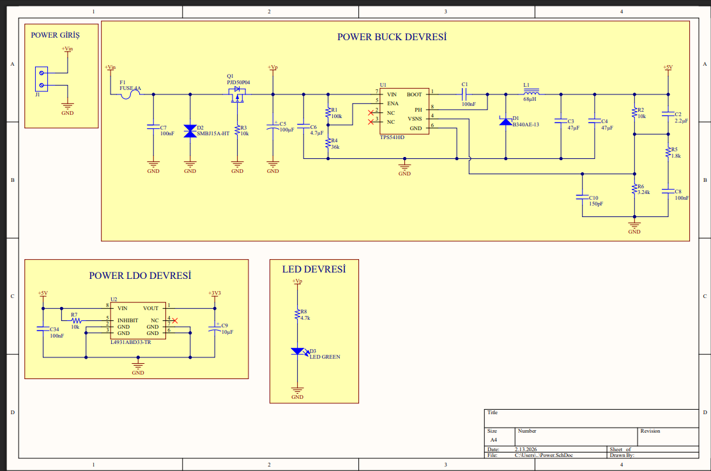
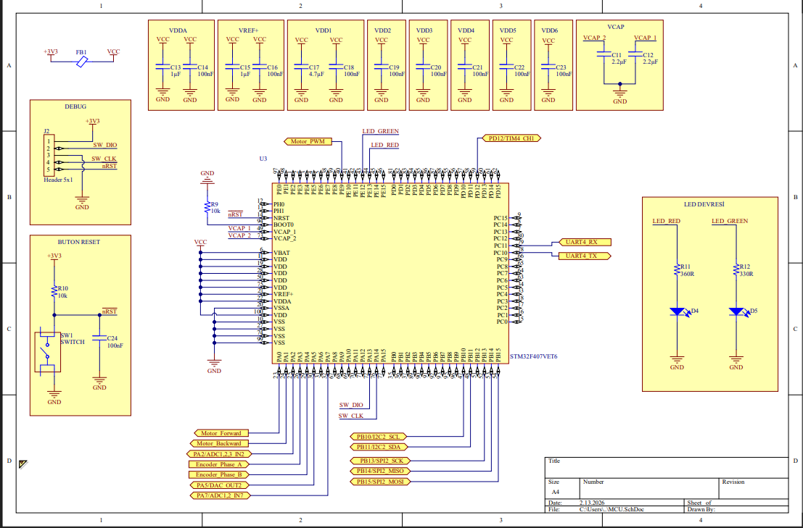
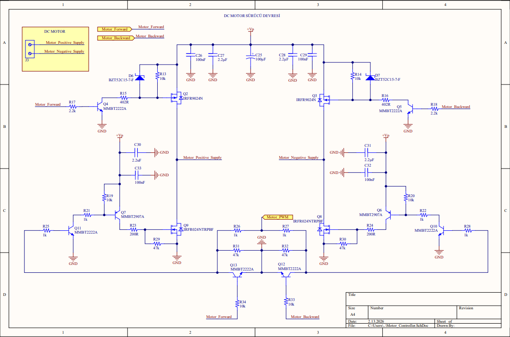
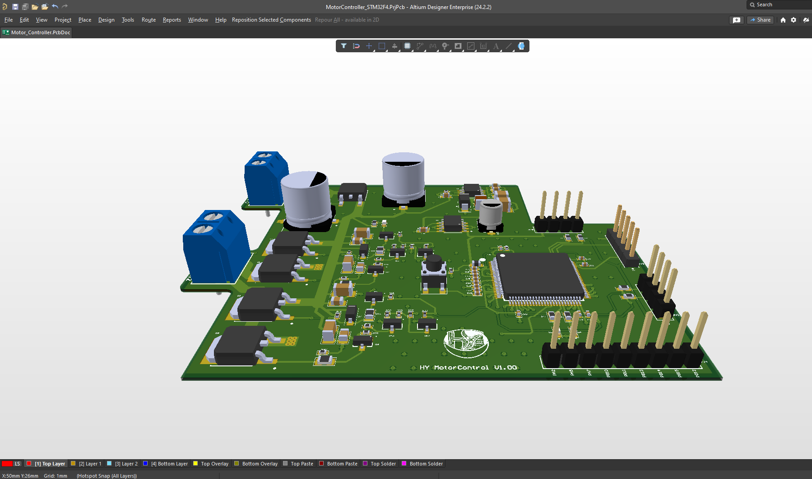
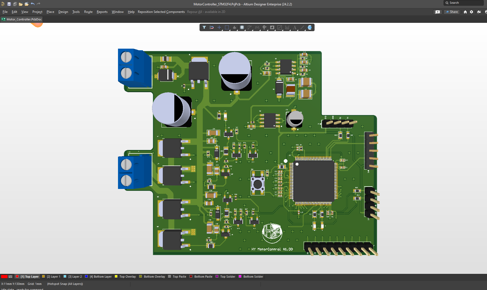
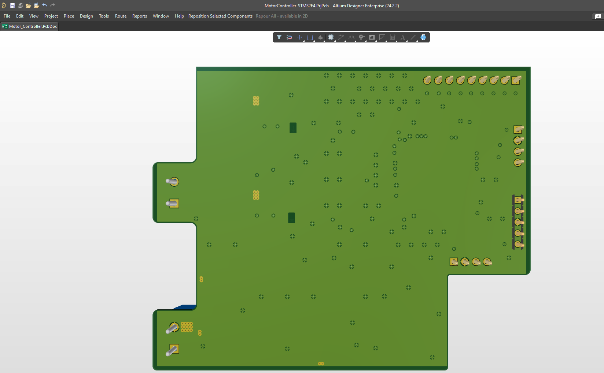

# STM32F4 DC Motor Kontrolcü ve Sürücü Donanım Tasarımı

Bu proje, STM32F407VET6 mikrodenetleyici tabanlı, encoder geri beslemeli ve yüksek performanslı hız/yön kontrolü yapabilen bir DC motor sürücü kartı donanım tasarımıdır. Tasarım, QT tabanlı bir masaüstü arayüzü ile UART üzerinden haberleşecek şekilde optimize edilmiştir.

## 🛠 Teknik Detaylar

### 1. Güç Yönetimi (Power Management)
* **Giriş Voltajı:** 12V DC.
* **Buck Converter:** TPS5410D kullanılarak oluşturulan 5V hattı, sistemin ana lojik beslemesini sağlar.
* **LDO Regülasyonu:** Hassas 3.3V bileşenler için düşük gürültülü regülasyon katmanı eklenmiştir.

### 2. Motor Sürücü Katı (H-Bridge)
* **Mimari:** IRFR9024N ve IRFR024N MOSFET çiftleri ile kurulan H-Bridge yapısı.
* **Kontrol:** PWM sinyalleri ile yön ve hız kontrolü, MMBT2222A transistör sürücüleri ile desteklenmiştir.

### 3. MCU ve Kontrol Ünitesi
* **İşlemci:** STM32F407VET6 (Cortex-M4).
* **Arayüzler:** Encoder sensör girişi, UART TTL (PL2303 uyumlu) haberleşme portu ve 9 adet genel amaçlı GPIO çıkışı.

---

## 📸 Görsel Sunum ve Tasarım Detayları

### 1. Şematik Tasarımı
Proje tasarımı, teknik dökümantasyonda detaylandırıldığı üzere modüler bloklar halinde kurgulanmıştır.

**Güç Katı ve MCU Bağlantıları:**

*TPS5410D Buck Converter ve sistem güç dağıtım şematiği.*

*STM32F407VET6 mikrodenetleyici ve temel bileşen bağlantıları.*

**Sürücü ve Sensör Arayüzleri:**

*H-Bridge sürücü katı ve MOSFET anahtarlama mimarisi.*

*Encoder girişleri ve dış dünyaya açılan GPIO/Haberleşme portları.*

### 2. PCB ve 3D Modelleme
Tasarım, üretime hazır (DFM) standartlarında ve sinyal bütünlüğü korunarak 4 katmanlı olarak tamamlanmıştır.

**Genel Görünüm:**

**Katman Analizi:**
| Üst Katman (Top View) | Alt Katman (Bottom View) |
| :---: | :---: |
|  |  |

---

## 📂 Proje Yapısı
* `/Design_Files`: Altium Designer şematik (.SchDoc) ve PCB (.PcbDoc) kaynak dosyaları.
* `/Documents`: Tüm katmanları, şematikleri ve malzeme listesini (BOM) içeren output job dosyaları.
* `/Images`: Şematik ve PCB görüntülerini içeren kaynak dosyaları.
* `/Production`: Üretim için gerekli Gerber ve NC Drill dosyaları.

---
